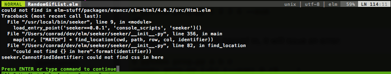
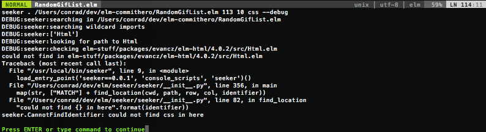

# vim plugin for seeker

seeker is a cli tool for jumping to the definition of a symbol in an elm project.

additionally, you can jump to the definitions of symbols defined in a project's dependencies
for the purposes of looking up documentation and how that code works.

based heavily on https://github.com/racer-rust/vim-racer

This is great for both moving around a project based on the context of where you're editing things,
or as a means of looking up how your project dependencies work or are documented because you're
jumping to the actual source of the functions you're calling.

## Installation

*NOTE: still in initial development.  Haven't even tried to install it the right way*

You need [seeker](https://github.com/cpdean/seeker) installed on your path.
I currently clone the repo locally and `pip install -e .` it.

You should be able to install it using Vundle or Pathogen in the usual ways.

## Usage

vim-seeker adds a new binding whenever you open an Elm file:

`gd` - go to the definition of a function

Because it does this with a regular jump, you can then use `CTRL-o` to jump back to where you were before, or `CTRL-i`
to jump forwards through your jump history.

## Troubleshooting `seeker` bugs

vim-seeker should display error message from the `seeker` cli tool:


Enable debug mode to display more useful information for figuring out what's wrong with `seeker`:

    :call SeekerToggleDebugMode()

And when you call it again you'll get much more information:


In the above example, I have a file that looks like:
```
module RandomGifList (..) where

import Effects exposing (Effects, map, batch, Never)
import Html exposing (..)
import Html.Attributes exposing (..)
import Html.Events exposing (..)
import Json.Decode as Json
import RandomGif
-- ...
```

So the fact that `seeker` only thinks it needs to search the `Html` module is a bit of a red flag -- there are two other modules which do wildcard imports.
